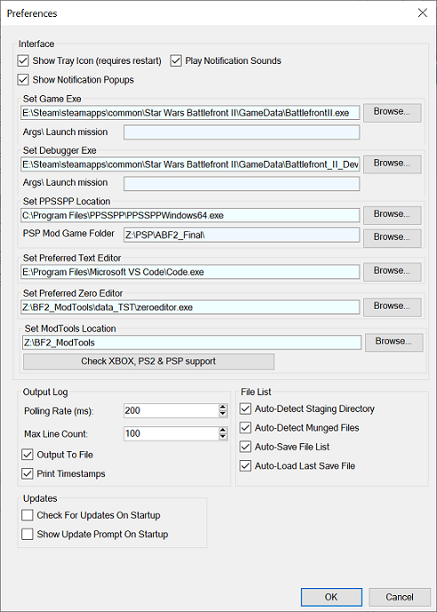

## Menus: Preferences

This section covers all the settings-related commands that Zero Munge can perform.

- **Preferences** – Opens the Preferences window, from which you can change various application settings such as checking for updates or showing the update prompt on startup, file list auto-save and auto-load, etc.

- **Set Game Exe** – Used to locate the game folder (file copy after munge).
- **Set Debugger Exe** – Used when executing 'Launch Debugger' (F6) and 'Launch mission in Debugger' (F7) actions.
- **Set PPSSPP Location** – Used when executing 'Launch PPSSPP' and 'Launch mission in Debugger' (F7) actions.
- **Set Preferred Text Editor** – Used when executing the 'Open BFront2.log' and 'Open Project Folder' (right click on file list) actions.
- **Set Preferred Zero Editor** – Used when executing the 'Launch Zero Editor' (F10) action.
- **Set ModTools Location** – Required to munge files.

### Related Pages

- [**Menus**](topic_menu.html)
- [**User Interface: File List**](topic_ui_filelist.html)
- [**Launch Mission**](topic_ui_launch_mission.html)