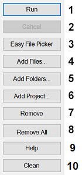

## User Interface: Actions

1. **Run** – Executes each file in the list in order.
2. **Cancel** – Stops processing files. WARNING: Canceling a munge is strongly NOT recommended.
3. **Add Files...** – Opens a prompt to add files to the list of files.
4. **Add Folders...** – Opens a prompt to add folders containing munge.bat files to the file list.
5. **Add Project...** – Opens a prompt to select a project folder whose common munge.bat files will be added to the file list.
6. **Remove** – Removes the selected file.
7. **Remove All** – Removes all files from the file list.
8. **Set Game Path...** – Opens a prompt to point Zero Munge to Star Wars Battlefront II's GameData directory.

### Related Pages

- [**Overview**](topic_ui_overview.html)