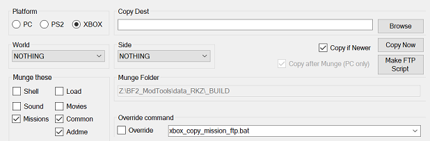

## Alternate UI

The Alternate UI can be accessed by pressing the 'F12' key or by choosing 'File -> Alternate UI'. It is intended to be used for console (XBOX, PS2/PSP) workflow; but can also be used for PC builds. 

Similiar in style to the VisualMunge tool, it also provides a 'Platform' selection option.

- **Copy Dest** – Different saved option for PS2 & XBOX. The PC dest is derived from the first project file in the fle list.
- **Munge Folder** – Displays the working mod folder.
- **Make FTP Script** – (XBOX only) UI to quickly create an FTP script.
- **Missions** – When you only have 'missions' selected, you will be given the option to munge only the 'mission.lvl' (normally, all of the common munge is performed to munge mission.lvl -Credit Teancum).
- **Override command** – The 'Override Command' combo box is populated with all the batch (.bat) files found in the current project's '_BUILD' folder. You can run any of these batch files from the Alternate UI by selecting one ( you can also pass arguments), checking the 'Override' check box and clicking the 'Run' button. The Override command combo box also has a context menu that will open the currently selected file in the preferred editor. 

### Related Pages

- [**Overview**](topic_ui.html)
- [**Platform**](topic_menu_platform.html)
- [**Make FTP Script**](topic_ui_make_ftp_script.html)
- [**User Interface: Context menus**](topic_ui_context_menus.html)