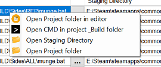
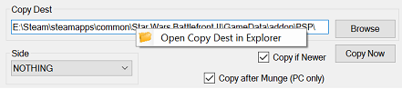
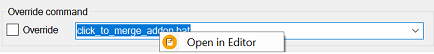

## User Interface: Context menus

There are multiple context menus in the Zero Munge User Interface.

### File List 

1. **Open Project folder in editor** – Open the current project folder with the user preferred text editor (VS Code or Notepad++ recommended).
2. **Open CMD in project \_BUILD folder** – Opens a command line terminal (CMD) in the current project '_BUILD' folder.
3. **Open Staging Directory** – Open the current project's staging folder (inside the game's 'addon' folder) in Windows Explorer.
4. **Open Project folder** – Open the current project folder in Windows Explorer.

### Alternate UI 

1. **Open Copy Dest in Explorer** – Open the Copy destination in Windows Explorer.

1. **Open In Editor** – Open the currently selected file in the Preferred editor.

### Related Pages

- [**Overview**](topic_ui.html)
- [**Alternate UI**](topic_ui_alternate_ui.html)
- [**File List**](topic_ui_filelist.html)