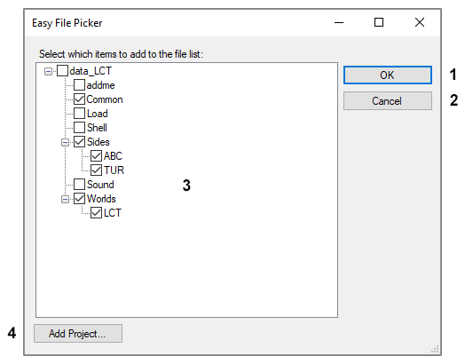

## User Interface: Easy File Picker

1. **OK** – Closes the dialog and adds the munge files for the selected items to the file list.
2. **Cancel** – Closes the dialog.
3. **Munge Files** – Tree view displaying mod projects and their munge-able components. Selected items are added to the file list. For example, in the above example, the munge files for Common, the ABC and TUR sides, and the LCT world would all be added to the file list.
4. **Add Project** – Opens a prompt to select another mod project folder to add to the Munge Files tree view. 

### Related Pages

- [**User Interface**](topic_ui.html)