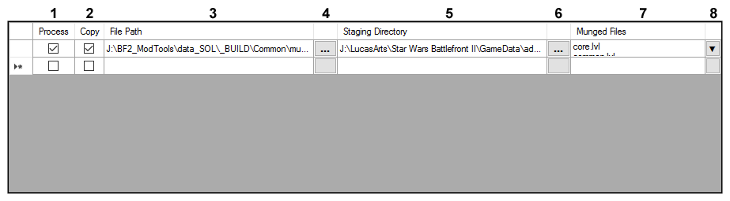
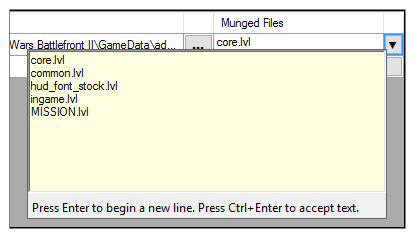

## User Interface: File List

1. **Process** – If checked, executes the batch script located at the specified File Path.
2. **Copy** – If checked, copies the specified Munged Files to the Staging Directory after the batch script has finished executing.
3. **File Path** – File path of the batch script to execute.
4. **File Path Browse** – Opens a prompt to browse for a new batch script.
5. **Staging Directory** – Directory to which the Munged Files are copied after the batch script has finished executing.
6. **Staging Directory Browse** – Opens a prompt to browse for a new Staging Directory.
7. **Munged Files** – Names of files that will be copied to the Staging Directory after the batch script has finished executing. Each file name must be separated into its own line.
8. **Munged Files Edit** – Opens a pop-up window to add/remove/edit names of Munged Files. Each file is separated into its own new line.

### Munged Files Edit

This is what the Munged Files Edit window looks like.

### Related Pages

- [**User Interface**](topic_ui.html)