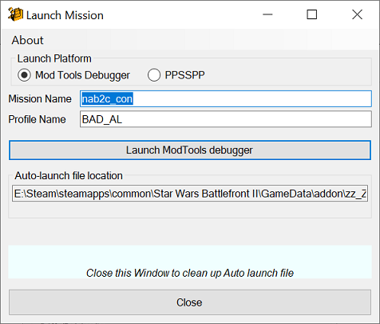

## User Interface: Launch Mission

The Launch mission action will work on PC and PPSSPP ('alt addon system' (https://github.com/Gametoast/AltAddonSystem)' required for PPSSPP;  ).

It works by placing a special addme.script in 'addon\\zz_ZeroEditorAutoLaunch' (or 'addon\999\' for PPSSPP ). When you close the 'Launch Mission' dialog, this folder will be deleted.

1. **Launch Platform** – Choose to use the ModTools Debugger or PPSSPP.
2. **Mission Name** – The mission file you want to launch/debug (Lua mission file, without the '.lua').
3. **Profile Name** – Specify the SWBFII profile name to launch as (if not specified, the game creates a default empty profile and will use 1st person mode on launch).
4. **Launch Button** – Launches the mission in the debugger/PPSSPP.
4. **Close Button** – Closes the dialog and deletes special auto launch file (you can also close with the 'X' title bar button or pressing the 'Esc' key).

### Related Pages

- [**Overview**](topic_ui.html)
- [**Preferences**](topic_menu_preferences.html)
- [**Platform**](topic_menu_platform.html)
- [**Alternate UI**](topic_ui_alternate_ui.html)