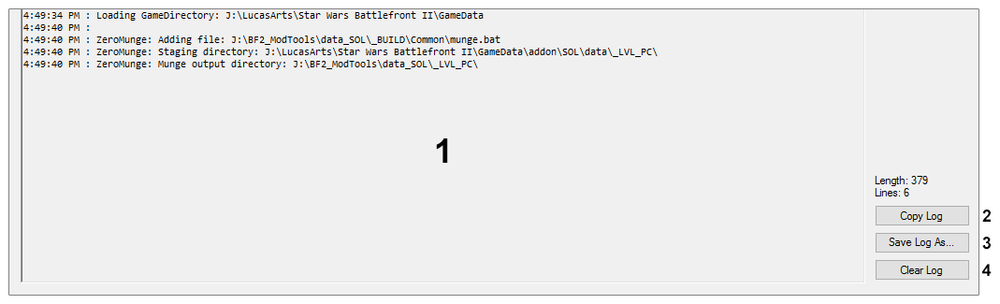

## User Interface: Output Log

1. **Log Window** – Displays the last 100 lines of the log file. Output is updated in real-time.
2. **Copy Log** – Copies the contents of the Log Window to the clipboard.
3. **Save Log As...** – Opens a prompt to save the contents of the log file to a new file.
4. **Clear Log** – Clears the contents of the Log Window.

### Related Pages
- [TODO]