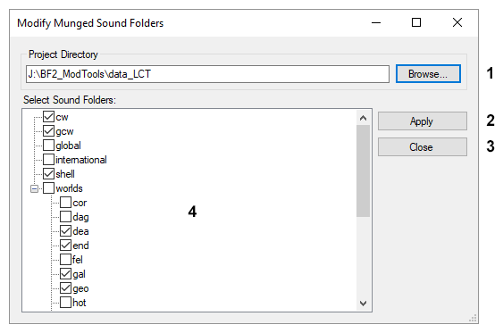

## User Interface: Modify Munged Sound Folders

1. **Browse** – Opens a prompt to select a new project directory. Please note that this repopulates the Sound Folders tree view.
2. **Apply** – Applies the modifications to the project directory's soundmunge.bat file. Each selected folder in the tree view will be added to the file.
3. **Close** – Closes the dialog.
4. **Sound Folders** – Tree view displaying all of the project's sound folders. Selected items are added to the project's soundmunge.bat file when the Apply button is clicked.

### Related Pages

- [**User Interface**](topic_ui.html)
- [**Commands: Tools**](topic_cmd_tools.html)